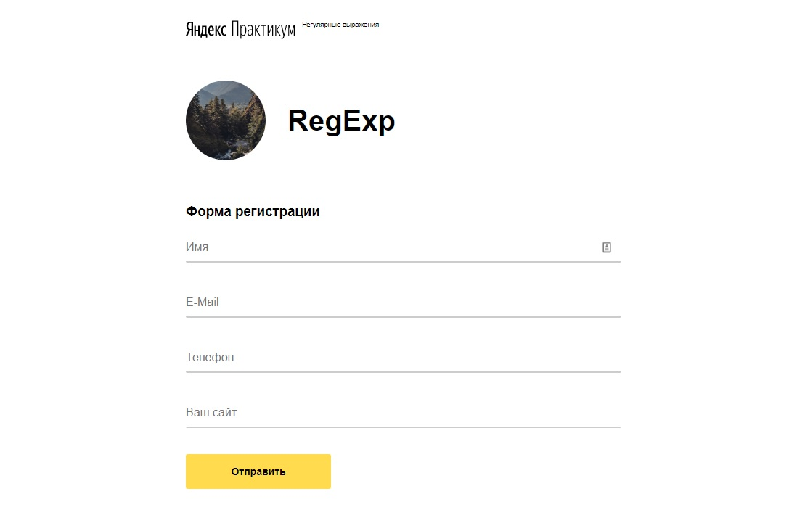

# sprint-10

Яндекс.Практикум. Проектная работа по регулярным выражениям.

Страница доступна на [GitHub Pages](https://anton-zm.github.io/sprint-10/)



### Валидация форм

### Name

- только кириллица;
- первая буква заглавная;
- можно ввести от 2 до 20 символов — это можно задать в атрибутах `minlength` и `maxlength`;
- возможна запись двойных имён — например `Анна-Мария`.

### Email

- только латиница;
- «собака» `@` — обязательный символ;
- Точка `.` — тоже обязательный символ.
- Цифры, подчерк, тире — разрешённые символы

### Телефон

Шаблон для телефона должен находить номера в таких форматах:

```text
    +7(925)900-90-90
    +7(925) 900-90-90
    +7 925-900-90-90
    +79259009090
    89259009090
```

В номере могут встречаться пробелы

### Сайт

- Адрес сайта должен начинаться с `http://` или `https://`;
- затем `www.` — это необязательная группа;
- IP-адрес — `255.255.255.255` или доменное имя — `stasbasov.ru`
- порт — тоже необязательная группа. Порт начинается с двоеточия, за которым идут от 2 до 5 цифр. Например: `:8080`;
- путь — последовательность из цифр, слешей и латинских букв, на конце которого может стоять решётка `#`.
